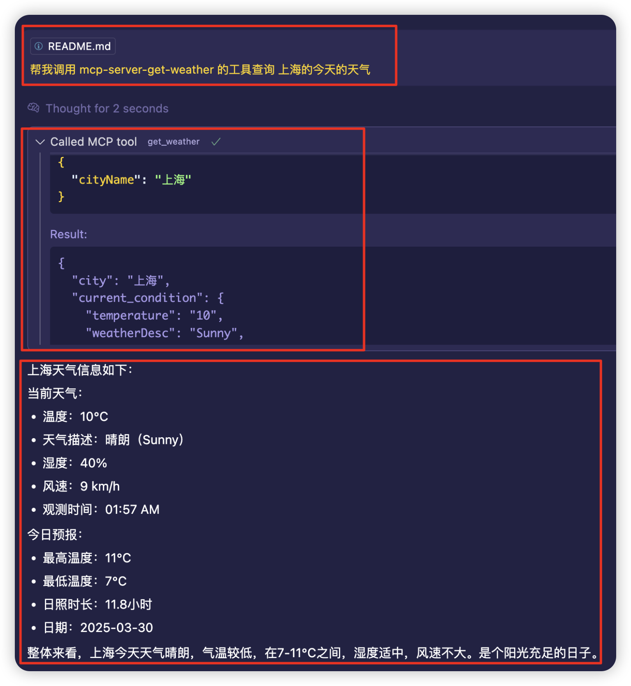

# Weather MCP Server

[中文文档](./README_CN.md) | English

A simple weather information service built with Model Context Protocol (MCP).

## Overview

Weather MCP Server provides weather information for cities around the world through a simple API interface. It uses the Model Context Protocol (MCP) to communicate with clients, allowing easy integration with AI assistants and other MCP-compatible applications.

## Features

- Get current weather conditions by city name
- Returns temperature, weather description, humidity, and wind speed
- Fallback to generated data if external API is unavailable
- Simple and lightweight implementation

## Tech Stack

- TypeScript
- Node.js
- MCP SDK (@modelcontextprotocol/sdk)
- Zod for validation

## Installation

1. Clone the repository
```bash
git clone https://github.com/Annihilater/mcp-server-get-weather
```

2. Install dependencies:

```bash
npm install
```

3. Build the project:

```bash
npm run build
```

## Usage

Start the server:

```bash
npx @modelcontextprotocol/inspector node dist/index.js
```

## MCP Configuration

要在Cursor中使用此天气服务，需要在`~/.cursor/mcp.json`文件中添加以下配置：

```json
"mcp-server-get-weather": {
  "command": "node",
  "args": [
    "<path-to-your-project>/dist/index.js"
  ]
}
```

将`<path-to-your-project>`替换为实际项目路径。配置完成后，可以通过MCP工具调用`mcp_mcp_server_get_weather_get_weather`函数来获取天气信息。

### Example




## API Reference

### get_weather

Gets weather information for a specified city.

#### Parameters

| Name | Type | Description |
|------|------|-------------|
| cityName | string | The name of the city to get weather for |

#### Response

Returns a JSON object with the following structure:

```json
{
  "city": "London",
  "current_condition": {
    "temperature": "15",
    "weatherDesc": "Partly cloudy",
    "humidity": "71",
    "windSpeed": "11",
    "observation_time": "06:53 PM"
  },
  "forecast": {
    "maxTemp": "16",
    "minTemp": "9",
    "sunHour": "7.4",
    "date": "2023-04-12"
  }
}
```

## Development

### Available Scripts

- `npm run build` - Builds the project and makes the entry point executable
- `npm run watch` - Watches for changes and rebuilds automatically
- `npx @modelcontextprotocol/inspector node dist/index.js` - Starts the server

### Project Structure

- `src/index.ts` - Entry point, sets up the MCP server with stdio transport
- `src/server.ts` - Server implementation, defines the weather tool

## License

MIT
