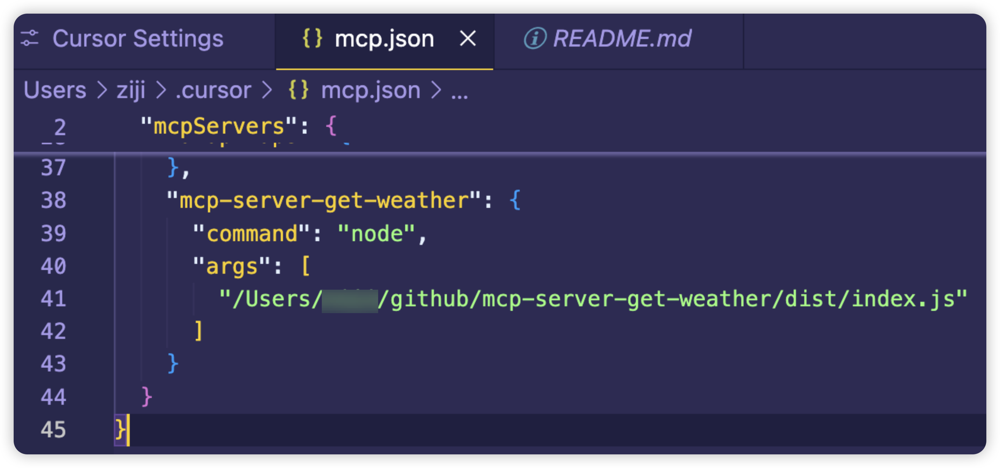
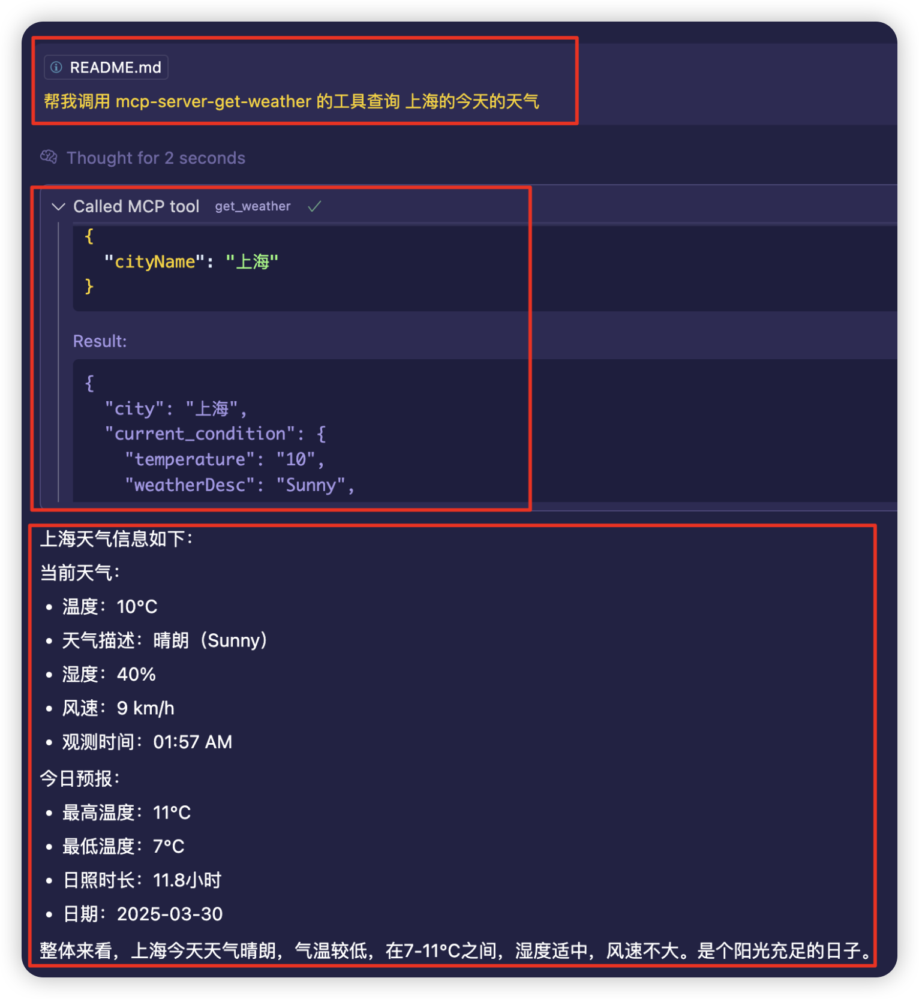

# 天气 MCP 服务器

基于模型上下文协议 (MCP) 构建的简单天气信息服务。

## 概述

天气 MCP 服务器通过简单的 API 接口提供全球城市的天气信息。它使用模型上下文协议 (MCP) 与客户端通信，便于与 AI 助手和其他兼容 MCP 的应用程序集成。

## 功能特点

- 根据城市名称获取当前天气状况
- 返回温度、天气描述、湿度和风速信息
- 当外部 API 不可用时自动切换到生成的模拟数据
- 简单轻量化的实现

## 技术栈

- TypeScript
- Node.js
- MCP SDK (@modelcontextprotocol/sdk)
- Zod 用于数据验证

## 安装方法

1. 克隆仓库
2. 安装依赖：

```bash
npm install
```

3. 构建项目：

```bash
npm run build
```

## 使用方法

启动服务器：

```bash
npx @modelcontextprotocol/inspector node dist/index.js
```

## MCP 配置

要在Cursor中使用此天气服务，需要在`~/.cursor/mcp.json`文件中添加以下配置：

```json
"mcp-server-get-weather": {
  "command": "node",
  "args": [
    "<path-to-your-project>/dist/index.js"
  ]
}
```

将`<path-to-your-project>`替换为实际项目路径。配置完成后，可以通过MCP工具调用`mcp_mcp_server_get_weather_get_weather`函数来获取天气信息。

### 示例




## API 参考

### get_weather

获取指定城市的天气信息。

#### 参数

| 名称 | 类型 | 描述 |
|------|------|-------------|
| cityName | string | 要获取天气信息的城市名称 |

#### 响应

返回具有以下结构的 JSON 对象：

```json
{
  "city": "北京",
  "current_condition": {
    "temperature": "15",
    "weatherDesc": "多云",
    "humidity": "71",
    "windSpeed": "11",
    "observation_time": "18:53"
  },
  "forecast": {
    "maxTemp": "16",
    "minTemp": "9",
    "sunHour": "7.4",
    "date": "2023-04-12"
  }
}
```

## 开发指南

### 可用脚本

- `npm run build` - 构建项目并使入口点可执行
- `npm run watch` - 监视文件变更并自动重新构建
- `npx @modelcontextprotocol/inspector node dist/index.js` - 启动服务器

### 项目结构

- `src/index.ts` - 入口点，使用标准输入输出传输设置 MCP 服务器
- `src/server.ts` - 服务器实现，定义天气工具

## 许可证

MIT 